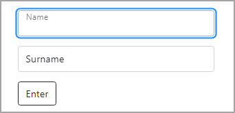

# Bootstrap 5 Floating labels

:open_book: [Documentation](https://getbootstrap.com/docs/5.0/forms/floating-labels/)

In this example `css` is used to change the height of the floating label. Otherwise the code for floating labels is generic as per the official example using Razor Pages for accepting and posting.

```css
.form-floating > .form-control,
.form-floating > .form-control-plaintext {
    padding: 0rem 0.75rem;
}

.form-floating > .form-control,
.form-floating > .form-control-plaintext,
.form-floating > .form-select {
    height: calc(2.5rem + 2px);
    line-height: 1;
}

.form-floating > label {
    padding: 0.5rem 0.75rem;
}
```


