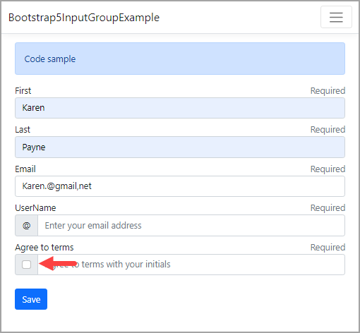

# Bootstrap 5 input-group, badge


## Input-group

:open_book: [documentation](https://getbootstrap.com/docs/5.0/forms/input-group/)

> **Note**
> Easily extend form controls by adding text, buttons, or button groups on either side of textual inputs, custom selects, and custom file inputs.

For configurations such as 'UserName' below we can use tag helpers to hook-up to backend properties of a page model but this is not the case with 'Agree to terms', in this case we must get the value of the checkbox using JavaScript.

Setup a hidden element

```html
<input type="hidden" 
       asp-for="Person.AgreeToTerms" 
       id="agreeValue" />

```

On form post get the value by element id than assign to the hidden element.

```javascript
<script>
    $('form').submit(function (e) {
        document.getElementById("agreeValue").value = 
            document.getElementById("agreeToTerms").checked;
    });
</script>
```

---



