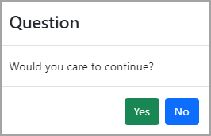
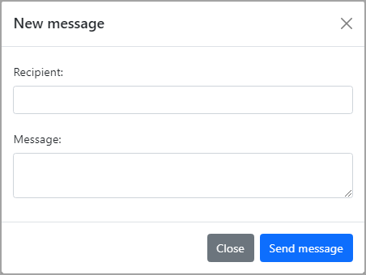

# Bootstrap Modal

:open_book: [documentation](https://getbootstrap.com/docs/5.0/components/modal/)

What is not shown in most examples is how to get data back from a modal which the two examples provided do.

When running, check the console window on post for each page.

 

