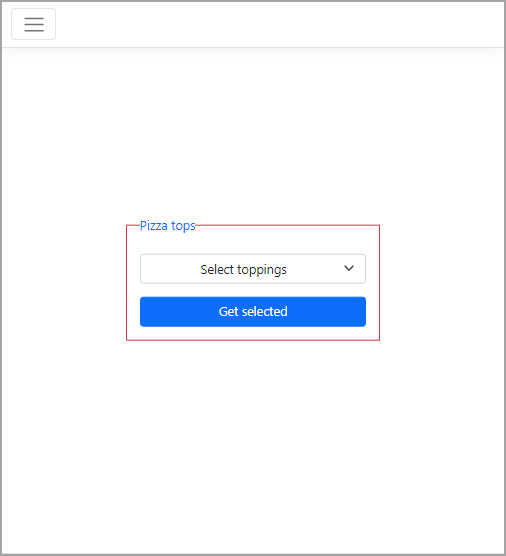
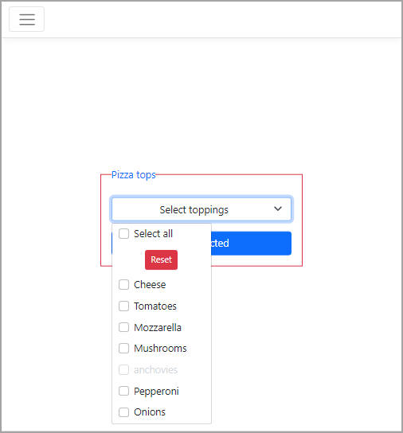
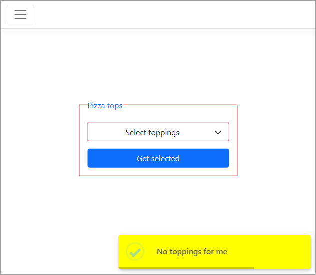

# Bootstrap Multiselect

This project shows [Bootstrap Multiselect](https://davidstutz.github.io/bootstrap-multiselect/index.html#getting-started) library. This library is robust with many options from configuration, themes, methods and events. For this article only basics are demonstrated.

Shown in a fieldset

Shown with options

- Select all, check to toggle check and and un-check all
- ~~Reset, un-check all~~

One would not normally use both `Select all` and `Reset`, both are shown to show what is possible but decided to exclude reset from the code sample, seemed like to much..

## Sweealert 2

[sweetalert2](https://sweetalert2.github.io/) is used here for toast.

