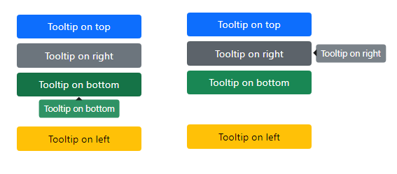

# Bootstrap 5 Tooltips

:open_book: [documentation](https://getbootstrap.com/docs/5.0/components/tooltips/)



- Initialize tooltips
- Set color of tooltip to what is set via `data-color` attribute
    - Note the hover does `button` and `input`

```javascript
<script type="text/javascript">
    // init tool-tips
    // change tool-tip color using data-color
    (function (window, document, $, undefined) {
        var tooltipTriggerList = [].slice.call(document.querySelectorAll('[data-bs-toggle="tooltip"]'));
        var tooltipList = tooltipTriggerList.map(function (tooltipTriggerEl) {
            return new bootstrap.Tooltip(tooltipTriggerEl);
        });

        $("button, input").hover(function () {
            $(".tooltip-inner").css({ "background-color": "var(--bs-" + $(this).data("color") + ")" });
        });
    })(window, document, jQuery);

</script>
```

# Arrow style

See `css/tips.css`


 ## Note

 For an application, use one color rather than various colors else there is a chance that after clicking on, in this case a button with no action the next hover over an element will keep the color of the last element/button.